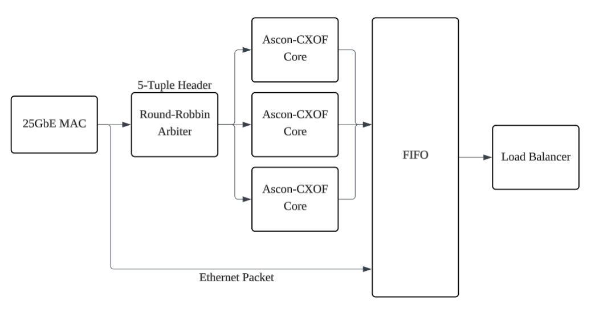
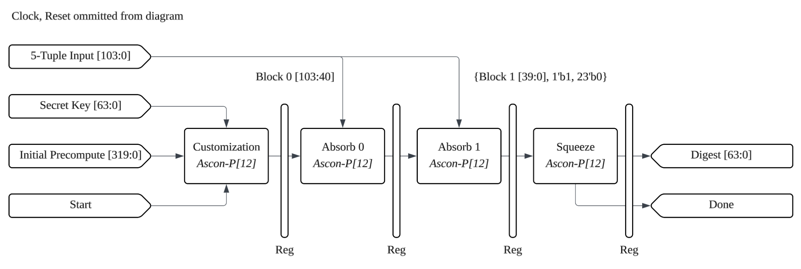
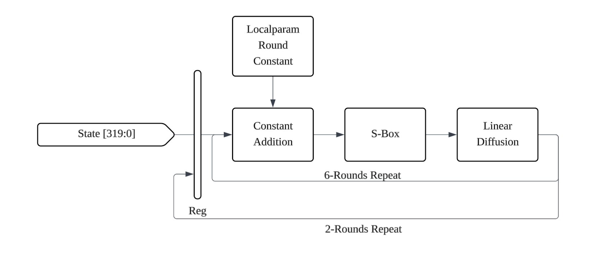

# Ascon-CXOF128 Ethernet Load Balancer targeting 25GbE SmartNIC

> *This is currently a proof-of-concept project, not meant for commercial deployment.*

GitHub Repository: https://github.com/yeoshuyi/Ascon-CXOF128-Ethernet-Load-Balancer

NIST Specification: https://csrc.nist.gov/pubs/sp/800/232/final

## Highlights

* Ascon-CXOF128 core with 10-cycle deterministic latency @ 125Mhz.
* Scalable to meet 25GbE line rate hashing of Ethernet 5-tuple.

## Introduction

Ascon-CXOF128 SystemVerilog implementation for hardware accelerated Ethernet 5-tuple hashing, used for HashDos protected packet load balancing. The NIST XOF128 specification allows for user-defined digest length, which makes it suitable to produce 64bit digest tags to route Ethernet packages downstream. The customizable variant (CXOF128) allows for the integration of a secret key, which helps to prevent offline-calculated HashDos attempts through an epoch-based secret key rotation.

The Ascon-CXOF128 cores is built to be scalable to different Ethernet line rates, with a round-robbin like arbiter to distribute packets to each core. The digest from each Ascon core is queued to a single digest buffer, and used to distribute load between downstream logic.

This specific implementation targets a 125MHz Frequency (Common for SmartNIC logic layer), on a Kintex Ultrascale+ architecture. The specific evaluation board used is the AS02MC04 board with 2x SFP28 ports.

## Documentation

### Block Diagram
#### `Load Balancer (WIP)`

* To keep up with 25GbE Line Rate, a new 5-tuple has to be processed every 26.88ns at worst case (non-stop transmission of tiny 672-bit ethernet packets).
* Each Ascon-CXOF core is able to process a new 5-tuple every 80ns.
* 3 Ascon-CXOF cores takes turn to process a 5-tuple in round-robbin style, and tags the digest to the ethernet packet in the FIFO.
* Load balancer distributes the ethernet packets downstream based on the 64-bit tag.

#### `Ascon-CXOF128 Core`

* Initial Precompute is the result of precomputed initialisation and first round of customization, as these 2 rounds are constant. This optimization removes 6 cycles of latency.
$$S_{\text{Initial Precompute}} = p^{12} \left( p^{12}(\text{IV}) \oplus (0x40 \parallel 0^{256})\right)$$
* Secret Key is rotated based on epoch. (Yet to be implemented)
* Each Ascon-p[12] round is pipelined.

#### `Ascon-Permute[12]`

* 6 Rounds of Constant-Addition, S-Box and Linear Diffusion is unrolled each clock cycle.
* Each Ascon-Permute[12] takes 3 clock cyles total (with 1 cycle for IO registering).
### RTL Modules
#### `ascon_wrap.sv (WIP)`
This module wraps 3 Ascon Cores and includes the round-robbin arbiter.

#### `ascon_cxof128.sv`
This module contains the Ascon-CXOF128 Core.

#### `ascon_permute.sv`
This module contains the unrolling logic for 12 Ascon Permute rounds.

#### `ascon_round.sv`
This moudule contains the logic for each Ascon Permute round.

## Testing
Running the testbench requires cocotb and Icarus Verilog via Makefile.

## Publication
> Hopefully haha.